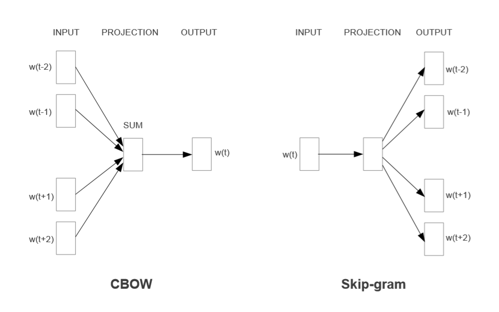
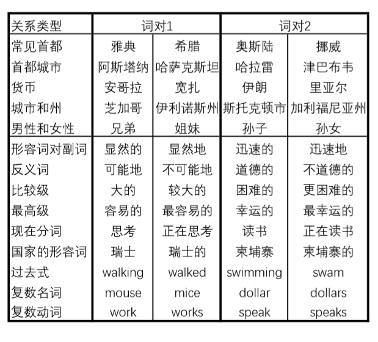
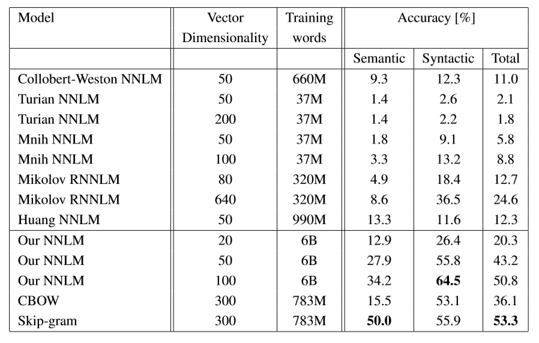
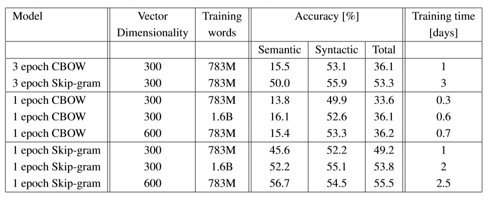
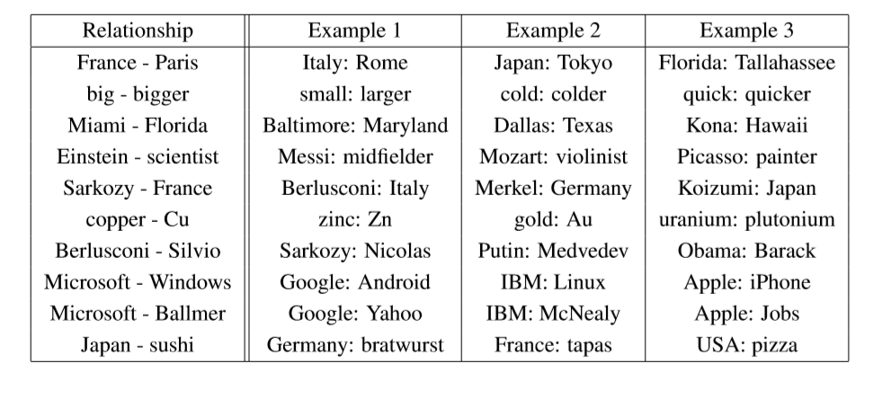

## 单词在向量空间的有效估计

### 原文：[Efficient Estimation of Word Representations in Vector Space](https://arxiv.org/abs/1301.3781)
### 作者：Tomas Mikolow, Kai Chen, Greg Corrado, Jeffrey Dean
#### Google 2013

### 目录：

[TOC]

#### 摘要  Abstract

我们提出两个新的模型架构为非常大的数据集计算单词的连续向量量表征（continuous vector representations of words）。这些表征（representations）的优劣使用单词相似度(similarity)测试来衡量，研究结果与之前基于不同类型神经网络的最佳表现技术进行了比较。我们观察到在精度上的巨大的提高和更低的计算开销等。它可以在一天以内从有16亿单词的数据集中学得高质量的词向量（word vectors）。此外，我们展示了这些向量在使用测试数据集衡量句法和语义词之间的相似度时的最好的性能表现。

#### 1 简介  Introduction

当前许多NLP系统和技术都把单词当作原子单位（atomic units)来处理-在单词之间没有相似度的概念，因为它们在词汇表（vocabulary）中表示为索引(indices)。这个选择有一些很好的理由，简单、健壮，同时简单模型训练大规模数据比复杂数据训练少量数据的标现更好。其中一个例子就是颇受欢迎且如今被当作统计语言模型的N-gram模型，它使训练几乎所有可用的数据（数万亿单词）成为可能。

然而，在很多任务上简单模型有自身的局限。例如，用于语音自动识别的相关数据是有限的，模型的表现通常由高质量的手抄演讲数据（通常只有数百万单词）的大小决定。在机器学习上，现存的许多语言的语料库只包含十亿或更少的单词。因此，在这种简单扩展基础技术的情形下将不会有任何的重大进步，于是我们不得不关注于更加高级的技术。

随着近年来机器学习技术的发展，使得在非常大的数据集上训练更复杂模型成为可能，且它们通常比简单模型表现得更好。大概其中最成功的概念便是单词的分布式表征（distributed representations of words）。例如，基于语言模型的神经网络的表现的远比N-gram模型更好。

##### 1.1 本文目标  Goals of the Paper

本文的主要目标是介绍一个可以被用来从数十亿的单词和数百万词汇表中学习高质量词向量的技术。据我们所知，以前尚无人提出一个成功训练超过几亿个单词，且可以训练出在50-100维的合适维度的词向量的架构。

我们使用最近提出的技术来测量所得矢量表征的质量，我们不仅希望相似的单词可以靠的更近，同时我们也希望单词有多重角度的相似性（multiple degrees of similarity）。这在较早的屈折语言（inflectional languages）环境中已被观察到。例如，名词可以有多个单词结尾，如果我们在原始矢量空间的子空间中搜索相似的单词，则可能找到具有相似结尾的单词。

令人惊奇的是，研究发现，词汇表征（word representations）的相似性（similarity of word representations）超越了简单的句法规则（syntactic regularities）。使用单词偏移技术（word offset technique），对词向量执行简单的算术操作。例如，向量（“King”）减去向量（“男人”）再加上向量（“女人”）的结果的向量非常接近于单词女王（Queen）的向量表征。
> 原文：vector(“King”) - vector(“Man”) + vector(“Woman”) results in a vector that is closest to the vector representation of the word Queen

本文，我们通过开发新的、可以保存单词线性规律的模型架构来尝试最大化这些向量操作的精度。我们设计了一个新的综合测试集来衡量句法和语义规律，实验结果表明，该方法具有较高的学习精度。此外，我们讨论了训练时间和训练精度如何依赖于词向量维度和测试数据的数量（训练时间和训练精度随两者的变化）。

##### 1.2 前期工作  Previous Work

使用连续向量来表征单词，已经有较长的历史。**[1]** 提出了一种非常流行的用于估计神经网络语言模型（neural network language model ，NNLM）的模型架构，它采用线性投影层和非线性隐藏层的前馈神经网络来共同学习词向量表征和统计语言模型。这项工作已经被许多人关注。

另一个有趣的NNLM架构由 **[13, 14]** 提出。它使用单个隐藏层的神经网络来第一次学习词向量，接着这个词向量被用来训练这个NNLM。因此，这个词向量可以从没有构造完整的NNLM中学习。再这项工作中，我们直接扩展这个架构，且仅仅关注于第一步。在这一步，词向量是从一个简单模型来学习得到的。

在稍后的研究中表明，这个词向量可以显著的提高和简化许多NLP应用 **[4, 5, 29]**。使用不同的模型架构和各种各样的语料库来对词向量进行估计，一些由此产生的词向量可用于将来的研究和比较。然而，据我们所知，这个架构训练的计算开销要比 **[13]** 所需的开销大的多，除了使用对数双线性模型某些版本，它使用了对角线权重矩阵 **[23]**。

#### 2 模型架构  Model Architectures

许多不同的模型被提出，用以估算连续的单词表征，包括著名的潜在语义分析（Latent Semantic Analysis，LSA) 和隐含狄利克雷分布模型（Latent Dirichlet Allocation，LDA）。本文，我们关注于从神经网络中学得的单词的分布式表征，正如先前的研究表明，在保存单词之间的线性规律上它的表现相对于LSA有极大的提高 **[20, 31]**；此外在大规模数据集上，LDA带来了相当大的计算开销。

与 **[18]** 相同，为了比较不同的模型架构，我们首先将模型的计算复杂度定义为完全训练模型所需的参数数量。接着，我们尝试最大化精确度，同时最小化计算复杂度。

对与接下来的所有模型，训练复杂度（training complexity）由以下公式计算：

这里的 E 是训练的次数（epochs），T 是训练集的单词数，Q 是模型架构的进一步定义。一般E的选择区间为[3, 50]，T 超过十亿。所有的模型使用随机梯度下降法（stochastic gradient descent，SGD）和反向传播（backpropagation）来训练 **[26]**。

##### 2.1 前馈神经网络语言模型  Feedforward Neural Net Language Model（NNLM）

[1]提出了概率前馈神经网络语言模型（feedforward NNLM)。它由输入、投影、隐藏和输出层构成。在输入层，对 N 前的单词使用 1-of-V 编码，其中 V 表示词汇表的大小。然后输入层投影到 N × D 维的投影层 P，它使用一个共享的投影矩阵。由于只有N个输入在给定时间处于活动状态，所以投影层的组成相对简单。

由于投影层中的值比较密集，这个NNLM架构也因投影层和隐藏层之间的计算变得复杂。一般选择 N=10，投影层 P 的大小为500到2000，同时隐藏层 H 的大小一般为500到1000。此外，隐藏层被用用于计算词汇表中所有单词的概率分布（probability distribution）情况，得出维度为 V 的输出层。因此，每个训练示例的计算复杂度（computational complexity）为：

这里主要取决于 H × V 项。针对这一问题，提出了几个可行的解决方案；要么使用分层softmax（hierarchical softmax） **[25, 23, 18]**，要么使用在训练过程中未标准化的模型来完全避免标准化模型 **[4, 9]**。使用二叉树来表示词汇表，这使得需要计算的输出单元数量可以减少到 log2(V) 左右。因此，N×D×H 项几乎决定了复杂度。

在我们的模型中，我们使用分层softmax，它的词汇表使用霍夫曼二叉树（Huffman binary tree) 表示。这与之前的观察结果一致，即单词的频率（frequency of words）对于在神经网络语言模型 **[16]** 中获取类（obtaining classes）非常有效。霍夫曼树为频繁词（frequent words）分配较短的二进制编码，这进一步减少了需要评估的输出单元（output units）的数量：而平衡二叉树（balanced binary tree）需要对 log2（V） 的输出进行评估，基于分层softmax的霍夫曼树只需要 log2(Unigram perplexity(V))。例如，当词汇表有100万词时，会使得评估速度提高大约两倍。虽然这对于神经网络LMs来说不是必须的加速，因为计算瓶颈在 N×D×H 项，我们接着提出了一个没有隐藏层的架构，因此它主要依赖于softmax归一化（softmax normalization）的效率。

##### 2.2 循环神经网络语言模型  Recurrent Neural Net Language Model（RNNLM）

基于语言模型的循环神经网络是因克服前馈NNLM的某些局限而提出。例如需要指定上下文的长度（模型N 的顺序），而且理论上循环神经网络(RNNs)相比浅层神经网络可以有效的表征更复杂的模式（pattrens）**[15, 2]**。RNN模型没有投影层（projection layer），只有输入（input）、隐藏（hidden)和输出(output)层。这个模型的特点是使用延时连接将隐藏层与其自身相连的递归矩阵（recurrent matrix）。这允许循环模型（recurrent matrix）构成某些短期记忆（short term memory），如可以被隐藏层表征的过去的消息的状态可以根据当前的输入和隐藏层前一步的状态进行更新。

RNN模型每个训练样本的复杂度为：

单词的表征 D 和隐藏层 H 有相同的维度。再次，H × V 项通过使用分层softmax可以有效的减少到 H × log2(v)。最多的复杂度来源于 H × H 项。

##### 2.3 神经网络的并行训练  Parallel Training of Neural Networks

为了在大规模数据上训练模型，我们在大规模分布式框架 DistBelief **[6]** 上实施了几个模型，其中包括前馈 NNLM 和本文新提出的模型。这个框架允许我们并行允许相同模型的多个副本，每个副本通过保存所有参数的集中服务器同步它的梯度更新。对于这些并行训练，我们使用小批量异步梯度下降（mini-batch asynchronous gradient descent）和称为 Adagrad **[7]** 的自适应（adaptive）学习率（learning rate）程序。在此框架下，它们通常使用100个或更多的模型副本，每个副本在数据中心的不同机器上使用多个CPU内核。

#### 3 新的对数线性模型  New Log-linear Models

在这个部分，为了最小化学习单词的分布式表征的计算复杂度，我们提出了两个新的模型架构。根据前面部分的观察，最多的计算复杂度主要由模型中的非线性的隐藏层（non-linear hidden layer）产生。这就是为什么神经网络如此吸引人的原因，我们决定探索更简单的模型，它或许不能像神经网络那样精确的表征数据，但是可以有效的训练更多的数据。

新的架构遵循于由我们早期工作所提出的 **[13, 14]**，在这些工作中我们发现神经网络语言模型可以被以下两步成功训练：首先，使用简单模型学得连续单词向量；接着，N-gram NNLM 在这些单词的分布式表征之上训练。虽然后来有着大量的关注于学习词向量的方法，但我们认为 **[13]** 提出的方法最为简单。注意，相关模型在早先也由 **[26, 8]** 提出。

##### 3.1 连续词袋模型  Continuous Bag-of-Words Model

第一个提出的架构和前馈 NNLM 相似，它移除了非线性的隐藏层，同时所有单词共享一个投影层（不仅仅是投影矩阵）；因此所有的的单词被投影到了相同的位置（它们的向量取平均值）。我们称这个架构为词袋模型，因为单词历史顺序对投影没有影响。更进一步，我们也使用单词作为构成未来词；我们在后面将要介绍的，使用四个未来词和四个历史词（four future and four history words)作为输入来构造一个对数线性分类器任务上得到了最佳的表现，它训练的标准是对当前（中间）词的正确分类器。训练复杂度为：

我们进一步的将模型表示为 CBOW，区别于标准的词袋模型，它使用上下文（context）的连续分布式表征。这个模型架构如图1所示。需要注意，输入和投影层之间的权重矩阵（weight matrix）使用与 NNLM 相同的方法在所有单词位置之间共享。

##### 3.2 连续Skip-gram模型  Continuous Skip-gram Model 

第二个架构和 CBOW 相似，但相反的是是基于上下文来预测当前的单词，它试图最大限度地根据同一句话中的另一个词对一个词进行分类。更进一步，我们使用每个当前词（current word）作为具有连续投影层的对数线性分类器的输入，并且预测当前单词前后一定范围内的单词。我们发现范围的增加提高了输出词向量的质量，但是它也增加了计算的复杂度。因为与当前词与相接近的单词要比距离比较远的单词（distant word）有更高的相关度，在我们的训练示例中，通过减少对这些单词的采样，我们减少了对距离比较远的单词的权重。

这点架构的训练复杂度为：

C 为单词的最大距离。因此，如果我们选择 C=5，对每个训练的单词我们将会在1到 C 的范围里选择一个随机数 R，接着使用当前词的 R 个历史单词和 R 个未来词作为正确的标签。这会要求我们做 R × 2 个单词的分类，其中当前词作为输入，R + R 个单词中的每一个都作为输出。在接下来的实验，我们使用 C=10.

图一：新的模型架构。CBOW 架构基于上下文预测当前词，Skip-gram 根据当前词预测周围词。

#### 4 结果  Rreaults

为了比较不同版本词向量的质量，以前的论文为了便于直观的理解通常使用一个表格来展示样例词（example words）和它们最相似的词（similar words），虽然很容易看出“法国”这个词和意大利或者其他一些国家很相似。如下所示，在复杂的相似度任务中对这些向量进行处理将更具挑战性。根据前面的观察单词之间可以有很多不同类型的相似性，例如，“big”和“bigger”意思相近，“small”和“small”意思相近。另一种关系的例子是单词对big - biggest 和 small - smallest **[20]**。我们进一步将两对关系相同的单词表示为一个问句问句，正如我们可以问：“那个单词与 small 的相似与 biggest和 big 的相似相同？”【注：就像，small - ？= big - biggest】。

令人惊奇的是，这些问题可以通过执行简单的单词向量表征的代数操作来回答。未来发现一个单词与 small 的相似与 biggest和 big 的相似相同，我们可以计算向量 X = 向量（“biggest”） - 向量（“big”） + 向量（“small”）。接着我们通过余弦距离（consine distance）在向量空间寻找最接近与 X 的向量，然后使用它作为问题的答案（我们在搜索过程中丢弃了输入的问题词）。当词向量被很好的训练后，可以使用这个方法的到正确的答案（smallest）。

最后，我们发现在大数据集上训练高维词向量后，得到的结果向量可以用来回答单词之间的非常精妙的语义关系。例如，一个城市和它所属的国家的语义关系，法国对巴黎与德国对柏林相似。这种语义关系的词向量可以用来提高像机器翻译、信息检索和问答系统一样的许多 NLP 应用，也可以用在未来提出的应用上。

表 1：语义-句法词关系测试集（Semantic-Syntactic Word Relationship test set）的5种语义示例和9种句法问题示例。[原表链接](../images/Efficient_Estimation_of_Word_Representations_in_Vector_Space/no8.PNG)

##### 4.1 任务描述  Task Description

为了衡量词向量的质量，我们定义一个包含5种语义问题和9种句法问题的综合测试数据集。每个目录的例子如表 1所示。其中有8869个语义问题，有10675的句法问题。每个目录的问题使用以下两部创建：首先，手动列出近义词对。接着通过连接两个词对构成一个大的问题列表。例如，我们列出68个大的美国城市和它们隶属州的列表，通过随机拾取其中两个词对构成了大约2500个问题。我们的测试集只包括单个的标记词（token words），因此，不存在多字实体(如New York)。

我们评估了所有问题类型的总体准确性，以及每种问题类型(语义、句法)的总体准确性。只有当使用上述方法计算的向量与问题中正确的单词完全相同时，才认为问题得到正确答案；同义词因此被视为错误。这也意味着达到100%的准确率是不可能的，因为目前的模型没有任何有关单词形态学的输入信息。然而，我们认为单词向量在某些应用中的有用性与准确性指标正相关。通过整合有关单词结构的信息，尤其是句法问题，可以实现进一步的发展

##### 4.2 精度最大化  Maximization of Accuracy

我们使用谷歌新闻语料库（Google News corpus）训练词向量。这个语料库包括60亿标记。我们限制单词表大小为100万个最频繁的单词。现然我们面对着时间约束的优化问题，正如预料的那样使用更多数据和更高维度的词向量能够提高精度。为了估算模型架构的最佳选择，以便快速获得尽可能好的结果，我们首先评估了在训练数据子集上训练的模型，词汇量限制为最频繁的3万词。表 2展示了 CBOW 架构于不同词向量维度和增加训练数据量的结果。

从表中可以看出，增加维度数或者使用更多的训练数据带来的精度的提高越来越少。因此，我们必须同时增加向量维数和训练数据量。这个观察或许微不足道，但是必须要支持的是当前流行的是在大数据集上训练词向量，但对维度数目的要求却不足（例如50 - 100）。方程 4 所示，两次增加训练数据量，计算复杂度的增加与两次增加向量大小相同

如方程4所示，训练数据量增加两倍会使计算复杂度的增加大致相同，而向量大小会增加两倍。

根据表2和表4所示，我们在3个训练时期（training epochs）中使用随机梯度下降（stochastic gradient descent）和反向传播（backpropagation）。我们选择初始学习率（starting learning rate）为0.025，并将其线性降低，使其在最后一个训练周期结束时趋近于零。

表 2：使用 CBOW 架构和限制的单词表的词向量在语义-句法词关系测试子集上的精度。其中的问题只包含使用频率最高的3万个单词。[原表链接](../images/Efficient_Estimation_of_Word_Representations_in_Vector_Space/no9.png)

表 3：词向量维度选择640维时，不同模型架构训练相同数据之间的比较。我们报告了在语义-句法词关系测试集上的准确度，也在 **[20]** 中报告了在句法关系测试集上的准确度。[原表链接](../images/Efficient_Estimation_of_Word_Representations_in_Vector_Space/no12.png)

##### 4.3 模型架构间的比较  Comparison of Model Architectures

在先前的测试中，我们比较了不同模型架构在相同数据集生成的649维的词向量。在接下来的实验中，我们使用了新的语义-句法词关系测试集的全部问题。例如，不在限制词典数为3万。我们还包括了 **[20]** 中引入的测试集的结果，这个测试记重点关注于单词间的语法相似度。

这个测试集包括了一些 LDC 语料库，**[18]** 中有它们的细节介绍（3亿2千万字，8万2千词）。我们使用这些数据与之前在单个CPU上训练了8周的循环神经网络语言模型进行比较。我们使用 DistBelief并行训练（DistBelief parallel training）**[6]**技术，训练了一个具有640个隐藏单元的前馈NNLM。它使用8个历史先前词（history of 8 previous words），因此 NNLM 比 RNNLM 有更多的参数，它的投影层大小为640 × 8。

从表3中可以看出，RNN 词向量（在 **[20]** 中使用）在句法问题上有更好的表现。毫不意外的是，NNLM 向量表现比 RNN更好。因为 RNNLM的词向量直接于非线性的隐藏层链接。CBOW 架构在句法任务上比 NNLM精度更高，同时在语义上也差不多。最后，Skip-gram 架构在句法任务上比 CBOW略差（但仍比 NNLM好），但是它在测试集句法部分的表现要比其他的模型更好。

接下来，我们使用一个 CPU评估了我们训练的模型，并且比较了针对公共可用字向量（publicly available word vectors)的结果。表4给出了比较的结果。模型CBOW模型在Google新闻数据子集上训练了大约一天，而Skip-gram模型的训练时间约为三天。

表 4：针对在语义-句法词关系测试集的公共可用字向量（publicly available word vectors)的比较，词向量来源于模型。使用了所有的单词。

表 5：在相同数据集上，使用3个训练时期和1个训练时期所得出的模型间比较。在完整的语义-句法数据集上报告准确性。

如表5所示，使用1个训练时期在两倍数据上训练模型所得到的结果要比在3个训练时期上对相同数据进行迭代获得的结果相近或更好，并且训练速度更快。

##### 4.4 大规模的并行模型训练  Large Scale Parallel Training of Models

如上文所述，我们在 DistBelief分布式框架上实施各种模型。下面我们报告了在Google新闻60亿数据集上，使用小批量异步梯度下降和称为 Adagrad **[7]** 的自适应学习率程序，训练的几个模型的结果。在训练期间，我们使用50到100个模型复制。由于数据中心计算机与其他生产任务共享，因此CPU内核数是一个估计值，其使用量可能会变化很多。请注意，由于分布式框架的开销，除单机实现之外，CBOW模式下的Skip-gram模型的CPU使用率与之接近。结果记录在表6中。

表 6：使用DistBelief分布式框架训练的模型比较。请注意，训练1000维的 NNLM模型向量将花费太长时间

表 7：微软研究的语句完成挑战中模型的比较和组合。

##### 4.5 微软研究的语句完成挑战  Microsoft Research Sentence Completion Challenge 

微软研究句子完成挑战最近被作为高级语言模型和其他的 NLP技术 **[32]** 的任务提出。这个任务包括 1040个句子，每个句子里都少了一个单词，其目标是在给出的 5个合理选择的列表的情况下，选择与该句子其余部分最相关的单词。几个技术在这个数据集上的表现已经列出，其中包括 N-gram模型，LSA-based模型 **[32]**，对数双线性模型 **[24]**和一个循环神经网络的组合，它目前在该基准上保持55.4％的精确度 **[19]**。

我们也在这个任务下探索了 Skip-gram架构的表现。首先，我们用 **[32]** 提供的5千万单词训练640维模型，接着我们通过使用输入中的未知单词来计算测试集上每个句子的得分，并预测句子周围的所有单词。使用句子得分，我们从中选择最相似的句子。

表7简要总结了一些先前的结果和新的结果。尽管，Skip-gram模型在任务中表现不如 LSA相似性模型，但是它的得分与 RNNLM模型获得的分数互补，通过加权组合，得到了准确度58.9%的最佳结果（训练部分为的59.2%，测试部分为58.7%)。

#### 5 学习关系的示例  Examples of the Learned Relationships

表8显示了遵循各种关系的单词。我们遵循上述方法，通过减去两个单词向量定义关系，并将结果添加到另一个单词中。例如，巴黎 - 法国 + 意大利 = 罗马【原文：Paris - France + Italy = Rome】。从表中可以看出，准确度还不错，尽管还有许多的改进空间（请注意，使用我们假设精确匹配的准确度指标，表8中的结果只会得分约60％）。我们认为，使用更大规模数据集和更多维度训练的词向量将会有更好的表现，并且能开发出新的革命性的应用。提高准确性的另一种方法是提供一个以上的关系示例。通过使用10个示例而不是使用1个示例来构成关系向量（我们将各个向量平均在一起），我们观察到，在语义-句法测试中，我们的最佳模型的准确性绝对提高了约10%。

表 8：单词对关系的示例，使用表4中最好的词向量（基于7亿8千3百万单词的数据集，训练300维的 Skip-gram 模型）

也可以应用向量运算来解决不同的任务。例如，通过计算单词列表的平均向量并找到距离最远的单词向量，我们观察到了选择列表外单词的良好准确性。在某些人类智力测试中，这是一种常见的问题。显然，这些技术的引用仍有许多待发现。

#### 6 结论  Conclusion

本文研究了一组句法和语义语言任务中，由不同模型导出的单词的向量表征的质量。我们观察到相比于流行的神经网络（前馈或者循环的），使用简单的模型架构训练高质量的词向量是有可能的。因为使用更低的计算复制度，它可以从大数据集中计算高维度的词向量。使用 DistBelief分布式框架，在有数万亿词和基本上无限大的词汇表的语料库上训练 CBOW和 Skip-gram模型是有可能的。这比之前发表的同类模型的最佳结果要大几个数量级。

一个有趣的任务是semeval-2012任务2 **[11]**，其中单词向量最近被证明显著优于先前的技术水平。将公开可用的 RNN向量与其他技术一起使用，使Spearman的秩相关(Spearman's rank correlation）比以前的最佳结果 **[31]** 增加了50%以上。基于神经网络的的词向量在以前被用于许多 NLP任务上，例如情感分析 **[12]** 和语义检测 **[28]**。可以预料到，这些应用程序可以从本文描述的模型体系结构中获益。

我们正在进行的工作表明，词向量可以成功地应用于知识库（Knowledge Bases）中事实的自动扩展（automatic extension of facts），同时可以验证已存在事实的正确性。机器翻译实验的结果也显得非常有前景。在未来，比较我们的技术与 Latent Relational Analysis **[30]**和其他方法也会很有趣。我们相信我们的综合测试集将有助于研究界改进现有的评估词性向量的技术。我么同时期待高质量的词向量在未来会成为 NLP应用的重要组成部分。

#### 7 后续工作  Follow-Up Work

在这篇论文的最初版本完成后，我们发布了计算单词向量的单机多线程的C++代码，使用连续词袋和 Skip-gram 架构。训练速度明显高于本文之前的报道。例如，对于典型的超参数选择，大约是每小时数十亿字。我们还发表了代表了命名的实体（named entities）的140多万个向量，训练了1000多亿个单词。一些接下来的工作将在 NIPS 2013论文中发布 **[21]**。

***

#### 参考文献 References

**[1]**  Y. Bengio, R. Ducharme, P. Vincent. A neural probabilistic language model. Journal of Machine Learning Research, 3:1137-1155, 2003.

**[2]** Y. Bengio, Y. LeCun. Scaling learning algorithms towards AI. In: Large-Scale Kernel Machines, MIT Press, 2007.

**[4]** R. Collobert and J. Weston. A Unified Architecture for Natural Language Processing: Deep Neural Networks with Multitask Learning. In International Conference on Machine Learning, ICML, 2008. 

**[5]** R. Collobert, J. Weston, L. Bottou, M. Karlen, K. Kavukcuoglu and P. Kuksa. Natural Language Processing (Almost) from Scratch. Journal of Machine Learning Research, 12:24932537, 2011

**[6]** J. Dean, G.S. Corrado, R. Monga, K. Chen, M. Devin, Q.V. Le, M.Z. Mao, M.A. Ranzato, A. Senior, P. Tucker, K. Yang, A. Y. Ng., Large Scale Distributed Deep Networks, NIPS, 2012. 

**[7]** J.C. Duchi, E. Hazan, and Y. Singer. Adaptive subgradient methods for online learning and stochastic optimization. Journal of Machine Learning Research, 2011.

**[8]** J. Elman. Finding Structure in Time. Cognitive Science, 14, 179-211, 1990

**[9]** EricH.Huang,R.Socher,C.D.Manning and Andrew Y.Ng.Improving Word Representations via Global Context and Multiple Word Prototypes. In: Proc. Association for Computational Linguistics, 2012.

**[11]** D.A. Jurgens, S.M. Mohammad, P.D. Turney, K.J. Holyoak. Semeval-2012 task 2: Measuring degrees of relational similarity.In: Proceedings of the 6th International Workshop on Semantic Evaluation (SemEval 2012), 2012. 

**[12]** A.L. Maas, R.E. Daly, P.T. Pham, D. Huang, A.Y. Ng, and C. Potts. Learning word vectors for sentiment analysis. In Proceedings of ACL, 2011. 

**[13]** T. Mikolov. Language Modeling for Speech Recognition in Czech, Masters thesis, Brno University of Technology, 2007. 

**[14]** T. Mikolov, J. Kopeck´y, L. Burget, O. Glembek and J. ˇCernock´y. Neural network based language models for higly inflective languages, In: Proc. ICASSP 2009.

**[15]** T. Mikolov, M. Karafi´at, L. Burget, J. ˇCernock´y, S. Khudanpur. Recurrent neural network based language model, In: Proceedings of Interspeech, 2010. 

**[16]** T.Mikolov,S.Kombrink,L.Burget,J. ˇCernock´y,S.Khudanpur.Extensionsofrecurrentneural network language model, In: Proceedings of ICASSP 2011. 

**[18]** T. Mikolov, A. Deoras, D. Povey, L. Burget, J. ˇCernock´y. Strategies for Training Large Scale Neural Network Language Models, In: Proc. Automatic Speech Recognition and Understanding, 2011. 

**[19]** T.Mikolov.Statistical Language Models based on Neural Networks.PhD thesis,Brno University of Technology, 2012. 

**[20]** T. Mikolov, W.T. Yih, G. Zweig. Linguistic Regularities in Continuous Space Word Representations. NAACL HLT 2013.

**[21]** T. Mikolov, I. Sutskever, K. Chen, G. Corrado, and J. Dean. Distributed Representations of Words and Phrases and their Compositionality. Accepted to NIPS 2013. 

**[23]** A.Mnih,G.Hinton. A Scalable Hierarchical Distributed Language Model.Advances in Neural Information Processing Systems 21, MIT Press, 2009. 

**[24]** A. Mnih, Y.W. Teh. A fast and simple algorithm for training neural probabilistic language models. ICML, 2012. 

**[25]** F. Morin, Y. Bengio. Hierarchical Probabilistic Neural Network Language Model. AISTATS, 2005. 

**[26]** D. E. Rumelhart, G. E. Hinton, R. J. Williams. Learning internal representations by backpropagating errors. Nature, 323:533.536, 1986. 

**[28]** R. Socher, E.H. Huang, J. Pennington, A.Y. Ng, and C.D. Manning. Dynamic Pooling and Unfolding Recursive Autoencoders for Paraphrase Detection. In NIPS, 2011. 

**[29]** J. Turian, L. Ratinov, Y. Bengio. Word Representations: A Simple and General Method for Semi-Supervised Learning. In: Proc. Association for Computational Linguistics, 2010.

**[31]** A. Zhila, W.T. Yih, C. Meek, G. Zweig, T. Mikolov. Combining Heterogeneous Models for Measuring Relational Similarity. NAACL HLT 2013. 

**[32]** G. Zweig, C.J.C. Burges. The Microsoft Research Sentence Completion Challenge, Microsoft Research Technical Report MSR-TR-2011-129, 2011.

